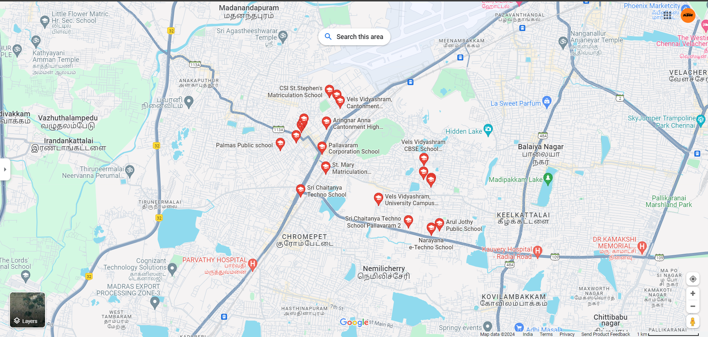

# Ex04 Places Around Me
## Date: 
08.04.2024
## AIM
To develop a website to display details about the places around my house.

## DESIGN STEPS

### STEP 1
Create a Django admin interface.

### STEP 2
Download your city map from Google.

### STEP 3
Using ```<map>``` tag name the map.

### STEP 4
Create clickable regions in the image using ```<area>``` tag.

### STEP 5
Write HTML programs for all the regions identified.

### STEP 6
Execute the programs and publish them.

## CODE
<!DOCTYPE html>
<html lang="en">
<head>
     <meta charset="UTF-8">
    <meta name="viewport" content="width=device-width, initial-scale=1.0">
    <title>School</title>
</head>
<script>
    function coord(event) {
        let x = event.clientX;
        let y = event.clientY;
        document.getElementById("txt1").value=x;
        document.getElementById("txt2").value=y;

    }
</script>
<body>
    

<map name="image-map">
    <area target="" alt="Narayana E Techno School" title="Narayana E Techno School" href="https://www.narayanaschools.in/chennai/pallavaram" coords="1112,628,1244,712" shape="rect">
    <area target="" alt="Sri Chaitanya Techno School" title="Sri Chaitanya Techno School" href="https://srichaitanyaschool.net/" coords="1115,582,975,630" shape="rect">
    <area target="" alt="Arul Jothy Public School" title="Arul Jothy Public School" href="http://aruljothypublicschool.com/" coords="1195,625,1315,596" shape="rect">
    <area target="" alt="Vels Vidyashram University Campus" title="Vels Vidyashram University Campus" href="https://velsvidyashram.ac.in/pallavaram/" coords="1022,527,1185,569" shape="rect">
</map><br>
</body>
</html>

## OUTPUT


## RESULT
The program for implementing image maps using HTML is executed successfully.
